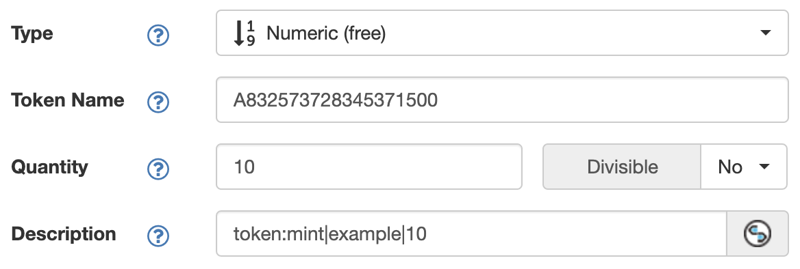

# BTC Tokens (XRC-20)

## Functions

### Deploy

- ` token:deploy|name|supply|max_mint|image`

### Mint

- ` token:mint|name|amount ` 

### Variables

- `name` - The name of the token
  - Alphanumberic OR
  - Unicode symbol `u+xxxx` 
- `supply` - The total supply amount
- `max_mint` - The max mint amount
- `image`
  - Base64 encoded image OR
  - Numeric asset name ( eg. `A7337447728884561000`)
- `amount` - The amount to mint

**No commas on `supply`, `max_mint` & `amount`**

## Deploy

`actions -> create token`

When deploying a new token, do so with `quantity = 1`.

### Example

`token:deploy|example|1000|10|A7337447728884561000`

## Mint

`actions -> create token`

- Mint tokens with `amount` less than or equal to `max_mint`.
- `amount` in the token mint function should match `quantity` of token mint

### Example

`token:mint|example|10` with `quantity = 10` 
